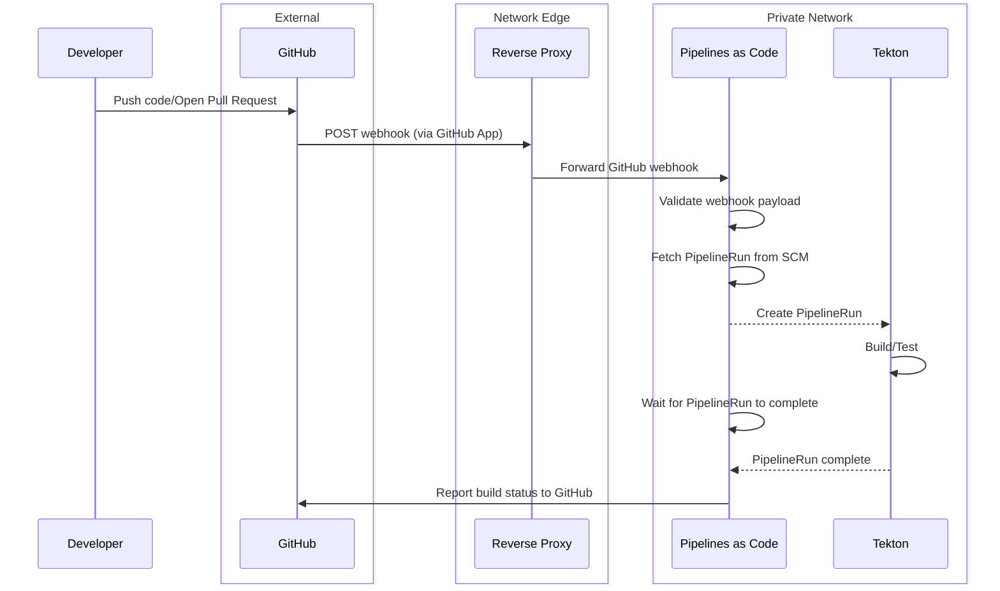

# project-euler
> Project Euler is a series of challenging mathematical/computer programming problems that will require more than just mathematical insights to solve. Although mathematics will help you arrive at elegant and efficient methods, the use of a computer and programming skills will be required to solve most problems.
> https://projecteuler.net/

## Overview
This repository is my take on Project Euler solutions as well as an example of various CI/CD tools.

## Languages and Build Tools

* Kotlin
* Gradle

## CI/CD Tools
The following CI/CD tools are used to build and test the code in this project.

* Tekton
* Pipelines as Code
* dependabot

### [Dependabot](https://docs.github.com/en/code-security/dependabot)
> Monitor vulnerabilities in dependencies used in your project and keep your dependencies up-to-date with Dependabot.

### [Tekton](https://tekton.dev/) + [Pipelines as Code](https://pipelinesascode.com/)

Tekton is used as the primary CI solution for building and testing the code in this repository. The Pipelines as Code
project supplements Tekton and allows PipelineRun definitions to be stored alongside the source code.

The Tekton instance is running on a self-hosted [k3s](https://k3s.io/) cluster to showcase the combining of a cloud-based SCM 
on-prem CI tools.

